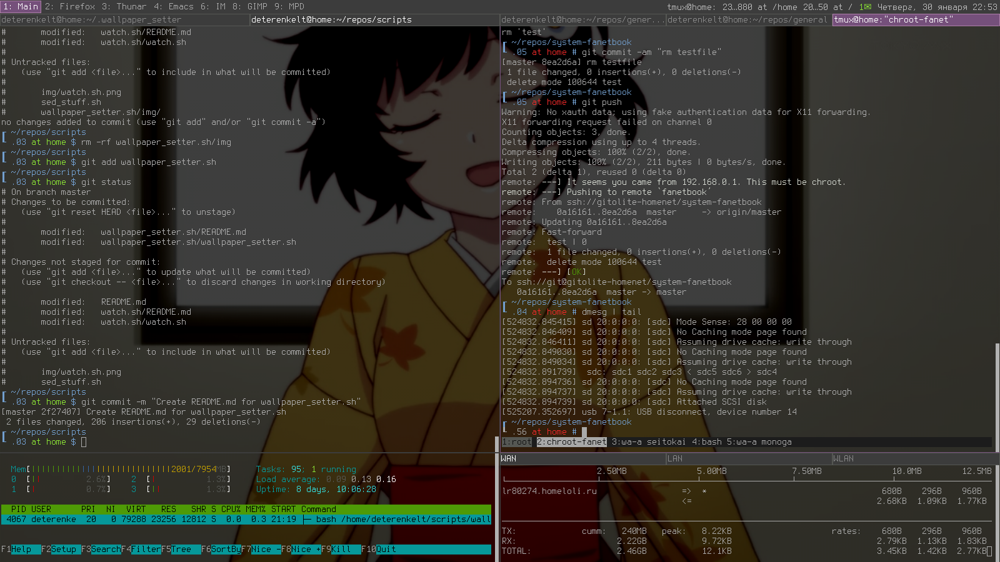
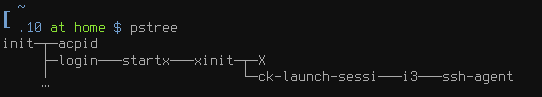

dotfiles
========

Configuration files for i3 window manager, Emacs, nano, bash, urxvt and other environment.

 
<i>This is how my desktop looks like as of january 2014 — 
all the windows were opened from the start of i3 WM</i>

### How X is started
Generally, there are two ways launching X – using a display manager (DM) or `startx`. DM takes care about sessions, switching display between users, `consolekit` session and some other stuff. 

#### Via ~/.bashrc and startx
1. login via tty2;
2. [~/.bashrc](.bashrc#L74) checks for DISPLAY variable and current tty, and, if DISPLAY is not set and tty is /dev/tty2, it launches startx and passes options to `X`;
3. `startx` is actually a wrapper over `xinit` which in its turn launches `X` with passed options (the difference between startx and xinit is AFAIR, startx creates file with auth information for the X server automatically, so one shouldn’t worry about it);
4. After X is up, `xinit` launches [~/.xinitrc](.xinitrc) file, and all the commands from there. Window manager (WM) is also intended to run from there. 

This is how `pstree` looks that way

#### Via DM
1. In the runlevel ‘default’ (its number usually between 3 and 5) starts a DM script which do authentication job, runs `X` (via `startx`, `xinit` or directly) and, after login is successful, launches a session which passes you to the graphical environment. If you choose option ‘custom session’ which is present in every normal DM, instead of any ‘default’ or ‘prepared’ session, your [~/.xsession](.xsession) file will be launched. This file is also handy to customize if you aren’t going to refuse of a DM usage yet;
2. ~/.xsession may launch your WM or whatever in same manneer as ~/.xinitrc does.

========
### URxvt and bash 
URxvt may use _resources_ from `~/.Xdefaults` or via certain X RESOURCE_MANAGER, managed by `xrdb` utility, which can load user’s [~/.Xresources](.Xresources) file to update resource base (look also at [~/.xinitrc](.xinitrc) where `xrdb` is calling). By default it will look for ~/.Xdefaults then in resources of the root window. The difference between these files is

~/.Xdefaults
* is obsolete;
* AFAIR, is just a file and nothing more;
* and does not support non-local X clients.

~/.Xresources
* is a modern way to set resources on a WM_CLASS basis;
* is also used for setting per-user X display options, like dpi.

when bash starts, it tries to source `/etc/profile`, then `~/.bash_profile`, `~/.bash_login` or `~/.profile`, usually `~/.bash_profile` is present and [~/.bashrc](.bashrc) is sourced from there. To customize keybindings [~/.inputrc](.inputrc) is used (See also `/etc/inputrc`). With these files, and also using urxvtd and urxvtc one can get terminal as light as a feather and have same keybindings as in preffered editor.
