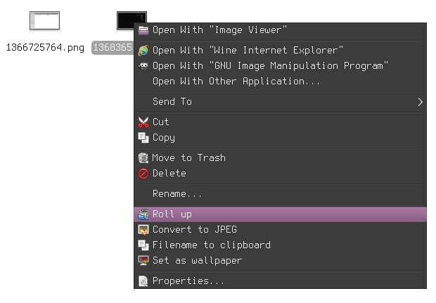

scripts
=======

A bunch of bash scripts used to extend functionality of the environment or just are helpful.

### add2playlist.sh
Add song currently playing in MPD to a playlist.

Used in
* [dotfiles/.i3/config](https://github.com/deterenkelt/dotfiles/blob/master/.i3/config)

### debug_package.sh
An attempt to automate process of recompiling a segfaulting program and running in it gdb to get a trace on Gentoo.
### imgur_upload.sh
Upload images to imgur.com frmo the command line.
### num2bin.sh
Small function to convert decimal numbers to their binary representation. Useful when you need to patch binary data.
### pngchunkinsert.sh
Insert a file in a PNG image.
### pngchunkextract.sh
Extracting counterpart of the script above.
### screenshot.sh
A wrapper for `scrot`. Allows to take a screenshot with a delay, take only an area and convert the image to indexed colours in place. The script uses `eog` to show the taken screenshot and sets command for removal to the `atd` (at daemon) after 10 minutes, so it wouldn’t be necessary to remove a screenshot manually later. If the screenshot is supposed to be saved, this can be done from the eog menu ‘Save as…’

Used in
* [dotfiles/.i3/config](https://github.com/deterenkelt/dotfiles/blob/master/.i3/config)

### thunar_ca.sh
Custom actions for `Thunar` file manager. They include font preview, conversion to JPEG and copying filename to clipboard.

Also look at
* [dotfiles/.config/Thunar/uca.xml](https://github.com/deterenkelt/dotfiles/blob/master/.config/Thunar/uca.xml)

### watch.sh
A wrapper for mpv/MPlayer to run videos easy via CLI.
It has moved to [its own repository](https://github.com/deterenkelt/watchsh).
